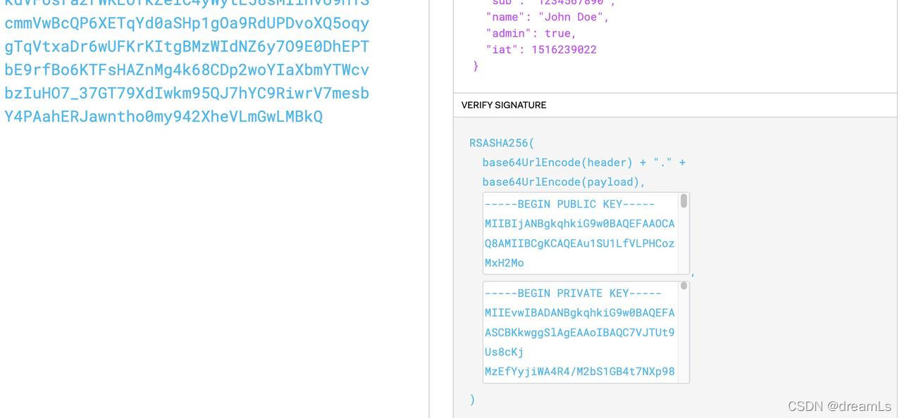
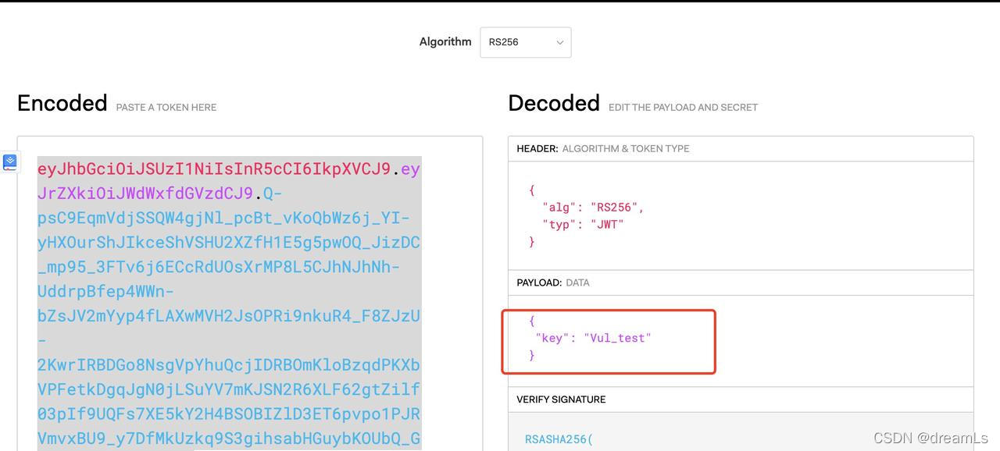

# CVE-2022-29266

## 介绍
在2.13.1版本之前的APache APISIX中，攻击者可以通过向受 jwt-auth 插件保护的路由发送不正确的 JSON Web 令牌来通过错误消息响应获取插件配置的机密。依赖库 lua-resty-jwt 中的错误逻辑允许将 RS256 令牌发送到需要 HS256 令牌的端点，错误响应中包含原始密钥值。

## 漏洞类型

信息泄露

## 漏洞影响版本
Apache APISIX <2.13.1

## 漏洞利用条件
无需登录
## 风险程度
高危

## 来源地址

[https://blog.csdn.net/m0_60732362/article/details/124412355](https://blog.csdn.net/m0_60732362/article/details/124412355)

## 利用过程

### RS256令牌构建

[JSON Web Tokens](https://jwt.io/#debugger-io) 网站中有个Debugger 可以帮助我们去快速构建。

我们需要填写三个部分、Header Payload VERIFY SIGNATURE。

2、Header 可以保持不变。

3、Payload 填写：{ "key": "Vul_test" } 。此时的key值是我们在注册 consumer 填写的key值。

4、VERIFY SIGNATURE 公钥、私钥不用改，可以使用。

5、最后在左边文本框里会帮我们自动生成 RS256令牌。前提是格式不能错，前两部分都是JSON格式。

命令行发起请求。命令行发起请求。在messages信息中能够获取到我们刚开始在 consumer 插件配置中填写的 secret

