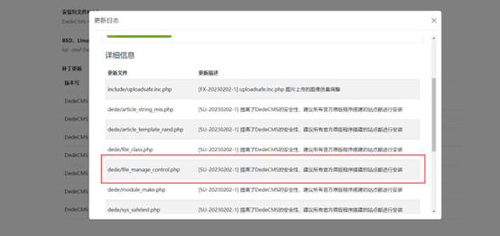
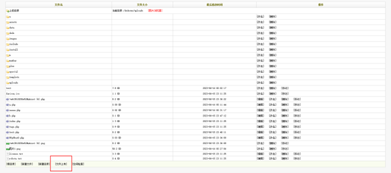
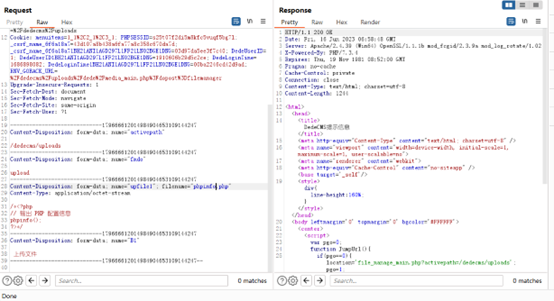

# CVE-2023-36298

>Dedecms是一款由上海卓卓网络科技有限公司研发的国产PHP网站内容管理系统，它可以让用户轻松地创建和管理各种类型的网站，如门户、企业、政府等，它具有强大的模板引擎、自定义模型、动静态部署、SEO优化等功能。

Since CVE-2022-43192 is not fully fixed, Dedecms still has a file upload vulnerability, leading to RCE.
After the vendor released 8 versions of patch updates, I still discovered a vulnerability here.
And the exploitation method is different from CVE-2022-43192.


## 来源

[https://github.com/MentalityXt/Dedecms-v5.7.109-RCE](https://github.com/MentalityXt/Dedecms-v5.7.109-RCE)

## 简介

DedeCMS 在 5.7.109 及之前版本存在文件上传漏洞，经过身份认证的攻击者利用系统的过滤缺陷可以上传恶意Webshell文件，从而控制服务器。

## 影响范围

-   DedeCMS <= 5.7.109

## 漏洞类型

文件上传

## Vulnerability to reproduce

Log in to the backend of the website.



Upload the file phpinfo.php, the content of the file is as follows:



```
/*<?php
phpinfo();
?>*
```

Visit `phpinfo.php`：


## Vulnerability Analysis

After adding comments using the /\*\*/ symbol in PHP, any code within the comment block will not be checked and can be easily uploaded. However, during actual access, the /\*\*/ comment symbols may not work as expected and the code within can still be executed.
