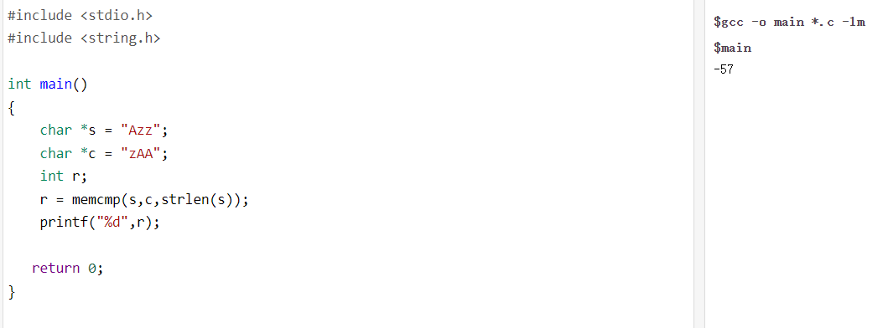
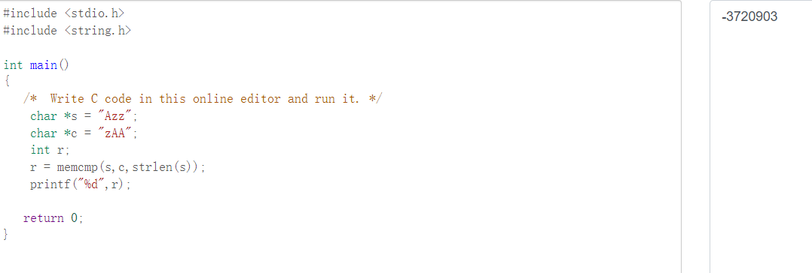

# CVE-2012-2122

## 简介

当连接MariaDB/MySQL时，输入的密码会与期望的正确密码比较，由于不正确的处理，会导致即便是memcmp()返回一个非零值，也会使MySQL认为两个密码是相同的。 也就是说只要知道用户名，不断尝试就能够直接登入SQL数据库。按照公告说法大约**256次**就能够蒙对一次。

## 成因

类型转化导致数据截断。

## 受影响版本

-   MySQL 5.1.x < 5.1.63
-   MySQL 5.5.x < 5.5.24
-   MySQL 5.6.x < 5.6.6
-   MariaDB 5.1.x < 5.1.62
-   MariaDB 5.2.x < 5.2.12
-   MariaDB 5.3.x < 5.3.6
-   MariaDB 5.5.x < 5.5.23

## CVE

[https://cve.mitre.org/cgi-bin/cvename.cgi?name=CVE-2012-2122](https://cve.mitre.org/cgi-bin/cvename.cgi?name=CVE-2012-2122)

## 漏洞环境

[docker](https://github.com/vulhub/vulhub/tree/master/mysql/CVE-2012-2122)

## 源码

[https://github.com/MariaDB/server/tree/mysql-5.5.23](https://github.com/MariaDB/server/tree/mysql-5.5.23)

## 分析

### 5.5.23版本

[代码](https://github.com/MariaDB/server/blob/mysql-5.5.23/sql/password.c#L534)

```c
/*
    Check that scrambled message corresponds to the password; the function
    is used by server to check that recieved reply is authentic.
    This function does not check lengths of given strings: message must be
    null-terminated, reply and hash_stage2 must be at least SHA1_HASH_SIZE
    long (if not, something fishy is going on).
  SYNOPSIS
    check_scramble()
    scramble     clients' reply, presumably produced by scramble()
    message      original random string, previously sent to client
                 (presumably second argument of scramble()), must be 
                 exactly SCRAMBLE_LENGTH long and NULL-terminated.
    hash_stage2  hex2octet-decoded database entry
    All params are IN.
  RETURN VALUE
    0  password is correct
    !0  password is invalid
*/

my_bool
check_scramble(const uchar *scramble_arg, const char *message,
               const uint8 *hash_stage2)
{
  SHA1_CONTEXT sha1_context;
  uint8 buf[SHA1_HASH_SIZE];
  uint8 hash_stage2_reassured[SHA1_HASH_SIZE];

  mysql_sha1_reset(&sha1_context);
  /* create key to encrypt scramble */
  mysql_sha1_input(&sha1_context, (const uint8 *) message, SCRAMBLE_LENGTH);
  mysql_sha1_input(&sha1_context, hash_stage2, SHA1_HASH_SIZE);
  mysql_sha1_result(&sha1_context, buf);
  /* encrypt scramble */
    my_crypt((char *) buf, buf, scramble_arg, SCRAMBLE_LENGTH);
  /* now buf supposedly contains hash_stage1: so we can get hash_stage2 */
  mysql_sha1_reset(&sha1_context);
  mysql_sha1_input(&sha1_context, buf, SHA1_HASH_SIZE);
  mysql_sha1_result(&sha1_context, hash_stage2_reassured);
  return memcmp(hash_stage2, hash_stage2_reassured, SHA1_HASH_SIZE);
}
```
#### memcmp函数

```
int memcmp(const void *str1, const void *str2, size_t n)
```

##### 参数

-   **str1** -- 指向内存块的指针。
-   **str2** -- 指向内存块的指针。
-   **n** -- 要被比较的字节数。

##### 返回值

-   如果返回值 < 0，则表示 str1 小于 str2。
-   如果返回值 > 0，则表示 str1 大于 str2。
-   如果返回值 = 0，则表示 str1 等于 str2。

字符串大小的比较是以ASCII 码表上的顺序来决定，此顺序亦为字符的值。memcmp()首先将 s1 第一个字符值减去 s2 第一个字符的值，若差为0 则再继续比较下个字符，若差值不为0 则将差值返回。例如，字符串 “Ac” 和 “ba” 比较则会返回字符 ’A'(65) 和 ’b'(98) 的差值(－33)。

[https://www.cainiaojc.com/tool/c/](https://www.cainiaojc.com/tool/c/)



这样逐个逐个的比较，速度太慢。而且C语言标准中并没有要求返回值一定在char的可表示范围内。Linux的glibc一般使用的是SSE优化后的代码，**它会一次读取多个字节，然后相减，结果可能是一个很大的数。**

[https://c.runoob.com/compile/11/](https://c.runoob.com/compile/11/)



#### my_bool

`include\my_global.h`

```c
// L995
typedef char		my_bool; /* Small bool */
```

#### 结果

memcmp返回一个 **integer** 。它隐式转换为my_bool，类型为char。如果memcmp碰巧返回最后一个字节为零的非零数字，尽管密码不正确，但check_scramble将返回0（密码正常）。

### 5.5.24版本-修复版

[代码](https://github.com/MariaDB/server/blob/mysql-5.5.24/sql/password.c#L534)

```c
/*
    Check that scrambled message corresponds to the password; the function
    is used by server to check that recieved reply is authentic.
    This function does not check lengths of given strings: message must be
    null-terminated, reply and hash_stage2 must be at least SHA1_HASH_SIZE
    long (if not, something fishy is going on).
  SYNOPSIS
    check_scramble()
    scramble     clients' reply, presumably produced by scramble()
    message      original random string, previously sent to client
                 (presumably second argument of scramble()), must be 
                 exactly SCRAMBLE_LENGTH long and NULL-terminated.
    hash_stage2  hex2octet-decoded database entry
    All params are IN.
  RETURN VALUE
    0  password is correct
    !0  password is invalid
*/

my_bool
check_scramble(const uchar *scramble_arg, const char *message,
               const uint8 *hash_stage2)
{
  SHA1_CONTEXT sha1_context;
  uint8 buf[SHA1_HASH_SIZE];
  uint8 hash_stage2_reassured[SHA1_HASH_SIZE];

  mysql_sha1_reset(&sha1_context);
  /* create key to encrypt scramble */
  mysql_sha1_input(&sha1_context, (const uint8 *) message, SCRAMBLE_LENGTH);
  mysql_sha1_input(&sha1_context, hash_stage2, SHA1_HASH_SIZE);
  mysql_sha1_result(&sha1_context, buf);
  /* encrypt scramble */
    my_crypt((char *) buf, buf, scramble_arg, SCRAMBLE_LENGTH);
  /* now buf supposedly contains hash_stage1: so we can get hash_stage2 */
  mysql_sha1_reset(&sha1_context);
  mysql_sha1_input(&sha1_context, buf, SHA1_HASH_SIZE);
  mysql_sha1_result(&sha1_context, hash_stage2_reassured);
  return test(memcmp(hash_stage2, hash_stage2_reassured, SHA1_HASH_SIZE));
}
```

#### test()

`include\my_global.h`

```c
// L478
#define test(a)		((a) ? 1 : 0)
```


## 参考

[Mysql身份认证漏洞](https://zgao.top/%E4%BB%8E%E7%B1%BB%E5%9E%8B%E8%BD%AC%E6%8D%A2%E6%88%AA%E6%96%AD%E5%88%86%E6%9E%90cve-2012-2122-mysql%E8%BA%AB%E4%BB%BD%E8%AE%A4%E8%AF%81%E6%BC%8F%E6%B4%9E/)