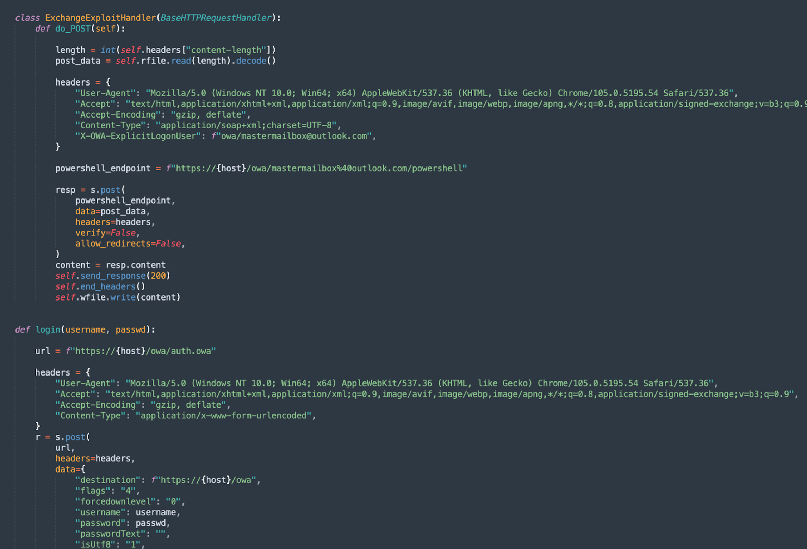

# CVE-2022-41080

## 来源

[https://github.com/ohnonoyesyes/CVE-2022-41080.git](https://github.com/ohnonoyesyes/CVE-2022-41080.git)

## 漏洞类型

请求伪造

## 漏洞影响

权限提升

## 漏洞简述

漏洞存在于Microsoft Exchange Server中，远程攻击者可通过Outlook Web Application (OWA)端点在受影响的系统上发起SSRF攻击。攻击者可将该漏洞与CVE-2022-41082漏洞配合使用，最终在目标服务器上执行任意代码。

## Desc

- CrowdStrike recently discovered a new exploit method (called OWASSRF) consisting of CVE-2022-41080 and CVE-2022-41082 to achieve remote code execution (RCE) through Outlook Web Access (OWA). The new exploit method bypasses URL rewrite mitigations for the Autodiscover endpoint provided by Microsoft in response to ProxyNotShell.
- The discovery was part of recent CrowdStrike Services investigations into several Play ransomware intrusions where the common entry vector was confirmed to be Microsoft Exchange.
- After initial access via this new exploit method, the threat actor leveraged legitimate Plink and AnyDesk executables to maintain access, and performed anti-forensics techniques on the Microsoft Exchange server in an attempt to hide their activity.

## Poc

## More

[https://www.crowdstrike.com/blog/owassrf-exploit-analysis-and-recommendations/](https://www.crowdstrike.com/blog/owassrf-exploit-analysis-and-recommendations/)
