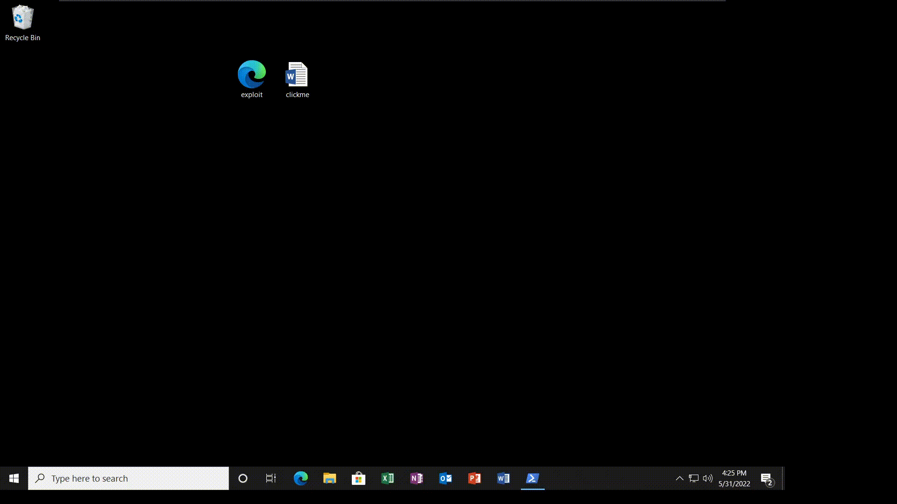

# CVE-2022-30190

## 来源

[https://github.com/onecloudemoji/CVE-2022-30190](https://github.com/onecloudemoji/CVE-2022-30190)

## 简介

Microsoft Windows 支持诊断工具 (MSDT)中存在一个远程代码执行漏洞。

## 影响范围

### Windows Server
  2012 R2 (Server Core installation)
  2012 R2
  2012 (Server Core installation)
  2012
  2008 R2 for x64-based Systems Service Pack 1 (Server Core installation)
  2008 R2 for x64-based Systems Service Pack 1
  2008 for x64-based Systems Service Pack 2 (Server Core installation)
  2008 for x64-based Systems Service Pack 2
  2008 for 32-bit Systems Service Pack 2 (Server Core installation)
  2008 for 32-bit Systems Service Pack 2
  2016 (Server Core installation)
  2016
  20H2 (Server Core Installation)
  2022 Azure Edition Core Hotpatch
  2022 (Server Core installation)
  2019 (Server Core installation)
  2019

### Windows RT 8.1

### Windows 8.1
  x64-based systems
  32-bit systems

### Windows 7
  x64-based Systems Service Pack 1
  32-bit Systems Service Pack 1

### Windows 10
  1607 for x64-based Systems
  1607 for 32-bit Systems
  x64-based Systems
  32-bit Systems
  21H2 for x64-based Systems
  21H2 for ARM64-based Systems
  21H2 for 32-bit Systems
  20H2 for ARM64-based Systems
  20H2 for 32-bit Systems
  20H2 for x64-based Systems
  21H1 for 32-bit Systems
  21H1 for ARM64-based Systems
  21H1 for x64-based Systems
  1809 for ARM64-based Systems
  1809 for x64-based Systems
  1809 for 32-bit Systems

### Windows 11
  ARM64-based Systems
  x64-based Systems

## 描述

Host exploit.html on localhost, port 80. Open the docx to pop calc.

To change the remote address the doc points to, open in 7Z and edit word\rels\document.xml.rels to point to a new location.

The exploit must contain at least 3541 characters before the window.location.href, and they must be within the script tag. There is about 6000 or so included in the exploit.html

